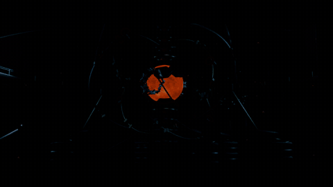

# SuperBlender

<p align="center"><strong>わずか65行で、あなたのCodexがblender-mcpを使ってゼロから大作を作れるようになるSkillです。</strong></p>

<p align="center"><a href="README.md">English</a> · 日本語 · <a href="README_ZH.md">简体中文</a></p>

> SuperBlenderは[Blender MCP](https://github.com/ahujasid/blender-mcp)向けに設計されたSkillです。このSkillを使う前に、BlenderをBlender MCPへ接続してください。

## 効果比較

各ペアは、Blender MCPをそのまま使った結果と、SuperBlenderを読み込んだ後の強化結果を示しています。

<table>
  <thead>
    <tr>
      <th width="50%" align="center">SuperBlender Off</th>
      <th width="50%" align="center">SuperBlender On</th>
    </tr>
  </thead>
  <tbody>
    <tr>
      <td align="center">
        <strong>人工太陽</strong><br><br>
        <a href="assets/raw_artificial_sun.mp4"></a><br>
        <sub><a href="assets/raw_artificial_sun.mp4">完全版MP4</a></sub>
      </td>
      <td align="center">
        <strong>人工太陽</strong><br><br>
        <a href="assets/enhanced_artificial_sun.mp4"></a><br>
        <sub><a href="assets/enhanced_artificial_sun.mp4">完全版MP4</a></sub>
      </td>
    </tr>
    <tr>
      <td align="center">
        <strong>遺跡の巨鯨</strong><br><br>
        <a href="assets/raw_whale.mp4"></a><br>
        <sub><a href="assets/raw_whale.mp4">完全版MP4</a></sub>
      </td>
      <td align="center">
        <strong>遺跡の巨鯨</strong><br><br>
        <a href="assets/enhanced_whale.mp4"></a><br>
        <sub><a href="assets/enhanced_whale.mp4">完全版MP4</a></sub>
      </td>
    </tr>
  </tbody>
</table>


## インストール

Codexにインストール内容を伝えるだけです。

```plaintext
First, verify that blender-mcp is available. Then install the skill from https://github.com/SCPZ24/SuperBlender into your skills directory.
```


## 仕組み

- 作る前に設計し、設計する前に調査する
- 再利用できるものはすべて再利用する
- 視覚的に検証する
- 大作を作りたいなら、トークンを惜しまない


## コントリビューション歓迎

コントリビューションを歓迎します。既存の[`cinematic-blender` Skill](skills/cinematic-blender/SKILL.md)を改善することも、[`skills/`](skills/)以下にほかのSkillを追加することもできます。

Skillは短く、効果は大きく！
